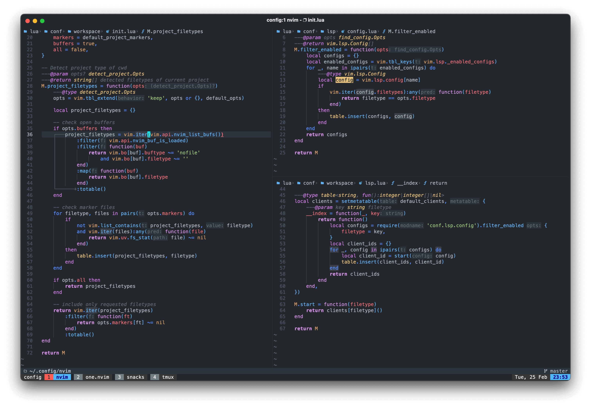
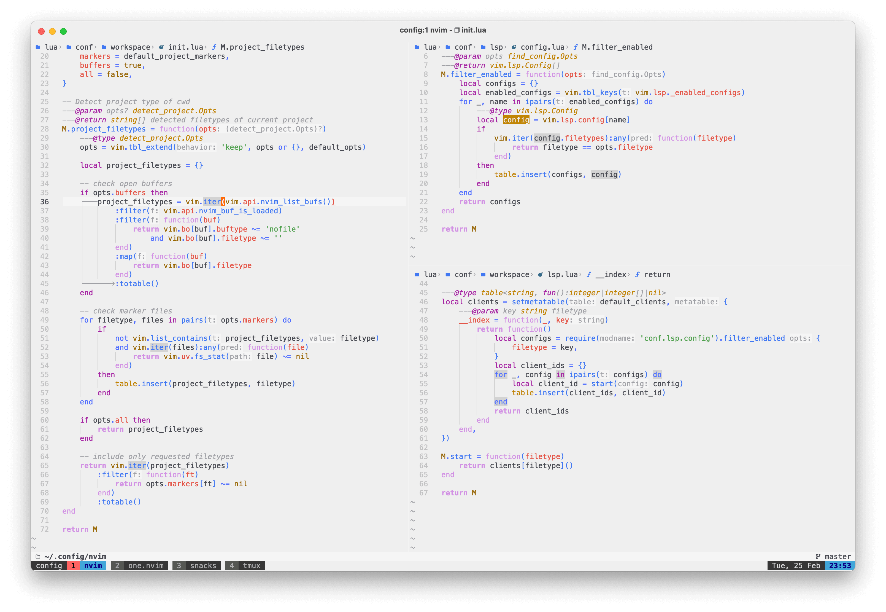

# One Neovim Theme

> personal fork of [one-nvim](https://github.com/Th3Whit3Wolf/one-nvim)

An Atom One inspired dark and light colorscheme for neovim. Plugin modeled after [highlite.vim](https://github.com/Iron-E/nvim-highlite/blob/master/colors/highlite.vim) template

## Screenshots

Dark theme



Light theme



_Font:_ Jet Brains Mono
_Statusline:_ [Spaceline](https://github.com/glepnir/spaceline.vim)
_RGB Highlightin:_ [nvim-colorizer.](https://github.com/norcalli/nvim-colorizer.lua)

### Getting Started

#### Packer

```lua
use {
    'disrupted/one.nvim',
    config = function()
        vim.cmd 'colorscheme one'
    end,
}
```
